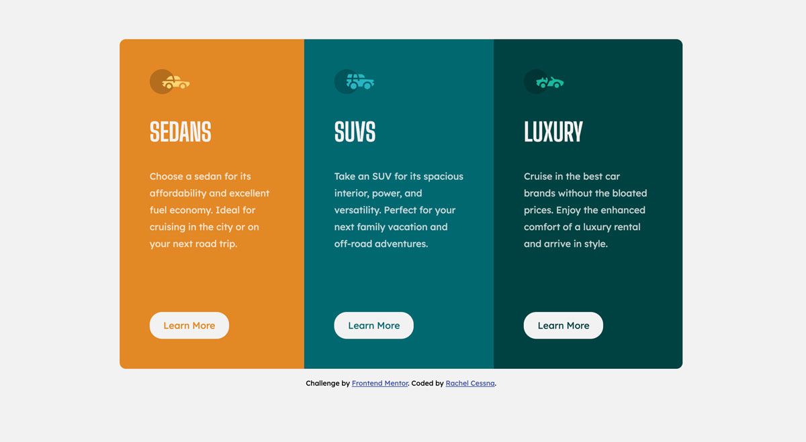
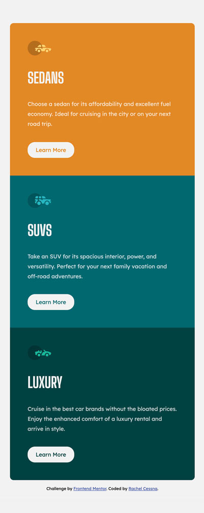

# Frontend Mentor - 3-column preview card component solution

This is a solution to the [3-column preview card component challenge on Frontend Mentor](https://www.frontendmentor.io/challenges/3column-preview-card-component-pH92eAR2-). Frontend Mentor challenges help you improve your coding skills by building realistic projects. 

## Table of contents

- [Overview](#overview)
  - [The challenge](#the-challenge)
  - [Screenshot](#screenshot)
  - [Links](#links)
- [My process](#my-process)
  - [Built with](#built-with)
  - [What I learned](#what-i-learned)
  - [Accessibility Note](#accessibility-note)
  - [Continued development](#continued-development)
  - [Useful resources](#useful-resources)
- [Author](#author)
- [Acknowledgments](#acknowledgments)

**Note: Delete this note and update the table of contents based on what sections you keep.**

## Overview

### The challenge

Users should be able to:

- View the optimal layout depending on their device's screen size
- See hover states for interactive elements

### Screenshot

#### Desktop View

#### Mobile View

### Links

- Solution URL: [GitHub Repo](https://github.com/cessnar516/FM-3-col-card-component)
- Live Site URL: [GitHub Pages](https://cessnar516.github.io/FM-3-col-card-component/)

## My process

### Built with

- Semantic HTML5 markup
- SASS
- Flexbox
- JavaScript

### What I learned

In this project, I practiced using JavaScript to generate the HTML for the cards by creating a Card constructor class (see Card.js). Each Card object is populated with an id, image source URL, name, text, and link URL (see data.js). In the script.js file, the Card objects are mapped into an array and the data for each card is used to generate a section element with a class of card and an id with the value from the object. Next, the image, card name (h2), paragraph text, and link are added to the inner HTML of each section. Finally, a for each loop is used to append the new sections to the main element of the document. The images for the cards are given empty alt attributes to signify to assistive technology that they are decorative elements, and descriptive aria labels are added to the links for accessibility purposes. 

The styles for the project were written in SASS utilizing variables. This practice allows shared properties, such as colors and fonts, to be easily updated globally. 

Flexbox and media queries were used to display the cards in three columns on desktop-sized screens. 

Initially, I achieved the rounded corners on the outside of the cards by targeting the first and last card and adjusted the border-radius with a media query for the different screen sizes; however, I discovered this styling could be more easily applied to the main element. When applied to the main, no adjustment to the border radius is needed, but you must set the overflow to hidden for the rounded corners to show up. 

### Acessibility Note

The orange color specified in the style guide for the Sedans card did not provide the contrast needed to comply with WCAG AA requirements, so I adjusted that color as well as the light gray for the headings and the transparent white text for the card paragraphs. Having sufficient color contrast is important to ensure individuals with low vision and/or color blindness are able to read the information. 

### Continued development

I think this project could benefit from an intermediate table-sized screen design. The mobile layout begins to look too wide before the desktop layout is implemented. 

For future projects, I plan to continue to practice with JavaScript so it becomes more familiar. 

### Useful resources

- [JavaScript Essential Training](https://www.linkedin.com/learning-login/share?account=76264346&forceAccount=false&redirect=https%3A%2F%2Fwww.linkedin.com%2Flearning%2Fjavascript-essential-training%3Ftrk%3Dshare_ent_url%26shareId%3DG25io%252FWLQ3iZbvHtQu5A9A%253D%253D) - Morten Rand-Hendriksen's JavaScript Essential Training on LinkedIn Learning really helped me get a basic understanding of JavaScript. Of all the tutorials I've completed, this one made the most sense to me. 
- [A Complete Guide to Flexbox](https://css-tricks.com/snippets/css/a-guide-to-flexbox/) - This is a great resource for understanding flexbox, and it provides lots of code examples and illustrations. 

## Author

- LinkedIn - [Rachel Cessna](https://www.linkedin.com/in/rachelacessna/)
- Frontend Mentor - [@cessnar516](https://www.frontendmentor.io/profile/cessnar516)
- CodePen - [@cessnar](https://codepen.io/cessnar)

## Acknowledgments

Thanks to Morten Rand-Hendriksen for helping me FINALLY understand a little bit of how to use JavaScript in my projects!
